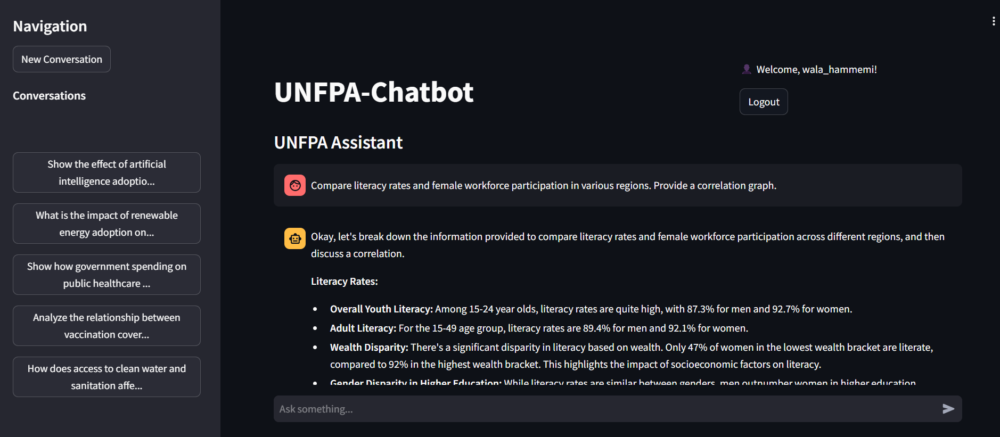
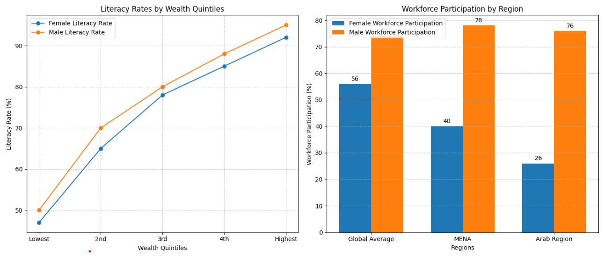

# UNFPA Evidence Chatbot

The UNFPA Evidence Chatbot is an interactive system designed to provide insightful responses and analyses. It leverages advanced AI models and Google Cloud services to enhance data retrieval, question answering, and user interaction.

## 🖼️ Execution Screenshots

Here are a couple of screenshots demonstrating the chatbot in action:

**Screen 1: Chatbot Interface and Response**



**Screen 2: Graph Generation**



## 🌟 Features
- **User Authentication**: Login and registration functionality to manage users securely.
- **Conversation Management**: Create, load, and delete conversations with ease.
- **Information Retrieval**: Retrieve data from a knowledge base using the RAG (Retrieval-Augmented Generation) system.
- **AI-Powered Responses**: Generate intelligent responses using Google Gemini, a state-of-the-art language model.
- **Graph Generation**: Visualize data by generating Python-based graphs.
- **File Analysis**: Analyze uploaded FDE files and provide detailed insights.
- **Data Storage**: 
  - **Firestore**: Store conversation and user-related data.
  - **Google Cloud Storage**: Handle and store images and generated content.
- **Interactive User Interface**: Built using Streamlit for seamless user interaction.
- **Cloud Deployment**: Hosted on Google Cloud Run for scalability and reliability.

## 🚀 Technologies Used
- **Frontend**: Streamlit
- **Backend**: Python (Flask and other libraries)
- **AI/ML**: 
  - Google Vertex AI for data retrieval.
  - Google Gemini for response generation.
- **Data Storage**: 
  - Firestore (NoSQL database).
  - Google Cloud Storage (file storage).
- **Deployment**: Google Cloud Run
- **Additional Tools**: Python libraries for visualization, data analysis, and more.

## 📈 Architecture Overview
The chatbot uses a modular architecture that integrates:
1. **Google Vertex AI**: To retrieve relevant data and knowledge.
2. **Google Gemini**: For response generation and advanced language understanding.
3. **Python-Based Graphs**: Generate detailed and customizable graphs.
4. **Cloud Infrastructure**: Deploy the system efficiently using Google Cloud Run.

## 🛠️ Setup Instructions
Follow these steps to run the project locally:

### Prerequisites
1. Python 3.9+ installed on your system.
2. Google Cloud account with the following services enabled:
   - Vertex AI
   - Firestore
   - Google Cloud Storage
3. `gcloud` CLI installed and configured.
4. Required Python packages installed (see `requirements.txt`).

### Steps
1. **Clone the repository**:
   ```bash
   git clone https://github.com/wala-ham/unfpa-evidence-chatbot.git
   cd unfpa-evidence-chatbot

## 📞 Contact

- **Name**: Wala Hammemi
- **GitHub**: [wala-ham](https://github.com/wala-ham)
- **Email**: [wala.hammemi00@gmail.com](mailto:wala.hammemi00@gmail.com)
- **LinkedIn**: [https://www.linkedin.com/in/wala-hammemi-6516a8231/](https://www.linkedin.com/in/wala-hammemi-6516a8231/) the icon of the image appears but the image itself dosnt' appear !

